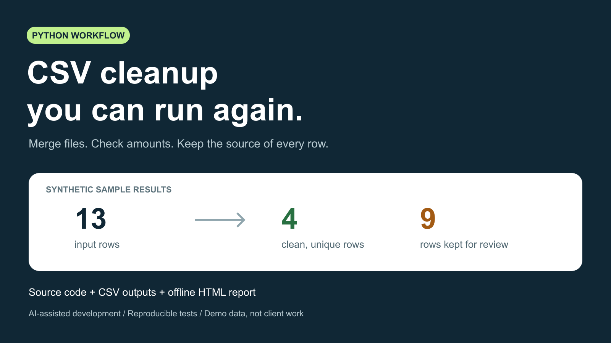

# LaborX CSV 服务文案与发布记录

状态：用户明确批准发布后，已点击 Publish；刷新页面后确认状态为 **Published**，标价 **120 USDC**。目前尚无买方或已确认合同，实际到账为 0。此文件保留已批准的服务范围与文案。

[LaborX 服务页面](https://laborx.com/gigs/i-will-clean-merge-and-validate-csv-files-with-a-python-script-122168)

## 中文核对

- 标题：I will clean, merge and validate CSV files with a Python script
- 价格：120 美元等值；已选定 Base USDC。
- 范围：最多 10 个 UTF-8 CSV，共 100,000 行，一套事先约定的表结构和币种。
- 交付：Python 脚本、清洗结果、保留重复和异常行的核对表、来源文件及行号、汇总、离线 HTML 报告和运行说明。
- 工期：确认范围、输入样例和平台托管资金后 3 天；含一次约定规则内的修改。
- 真实性：披露 AI 辅助；代码及封面使用合成数据，不宣称已有客户案例。
- 不包含：XLSX、模糊匹配、看板及额外集成，需要另定范围。

## 已保存的英文文案

I will turn a small, clearly scoped CSV cleanup task into a repeatable Python workflow.

Fixed scope: up to 10 UTF-8 CSV files and 100,000 rows in total, using one agreed table schema and currency. We will agree the column mapping, duplicate rules and validation rules before the order starts.

Delivery includes: a Python script, cleaned CSV output, a separate file retaining duplicate and invalid rows for review, source file and line references, a summary, an offline HTML report, and a short run guide. The workflow preserves leading-zero IDs and uses decimal arithmetic for amounts.

Price: USD 120 equivalent. Delivery: 3 days after the scope, input sample and escrow funding are confirmed. One revision within the agreed rules is included. Please send a small redacted or synthetic sample before ordering so we can confirm fit.

I use AI-assisted development and reproducible tests. The portfolio demo uses synthetic data; it is not a past client project. USDC on Base is preferred, subject to the payment options agreed through LaborX.

This package covers CSV processing. XLSX, fuzzy matching, dashboards and additional integrations require a separate scope.

Reproducible synthetic sample and tests: https://github.com/WeiliangHuang-UM-connect/codex-pro-100-dollar-experiment/tree/main/examples/csv-orders
